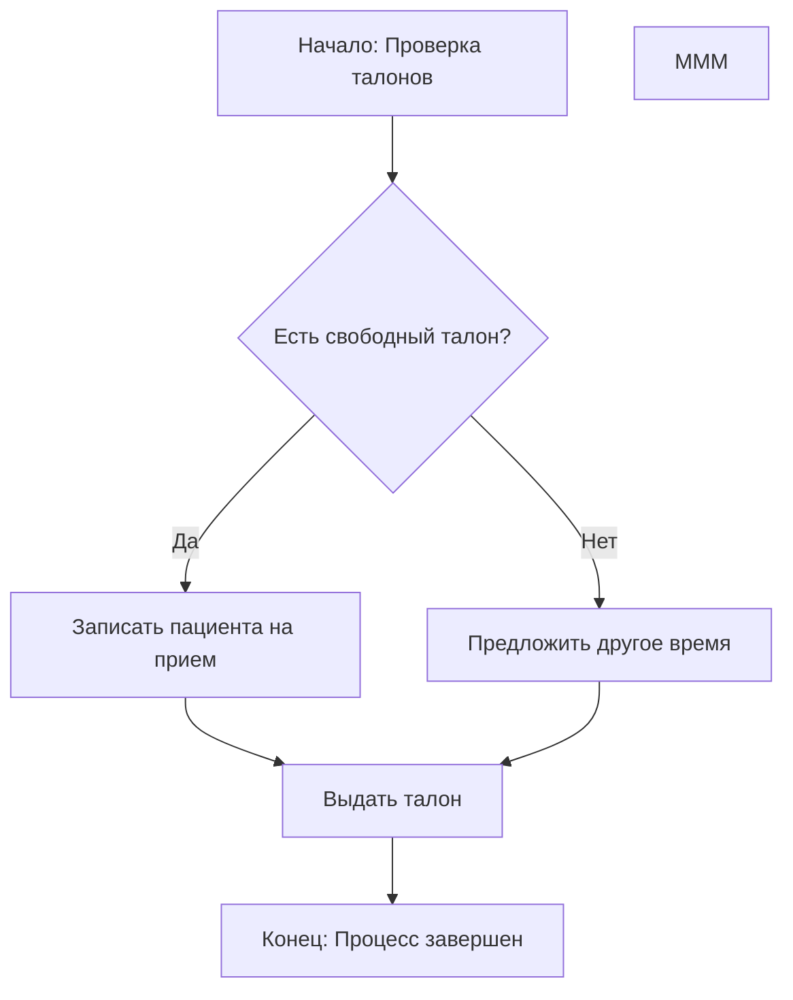

```mermaid
flowchart TD
    A[Начало: Проверка талонов] --> B{Есть свободный талон?}
    B -->|Да| C[Записать пациента на прием]
    B -->|Нет| D[Предложить другое время]
    C --> E[Выдать талон]
    D --> E
    E --> F[Конец: Процесс завершен]
    МММ
```
