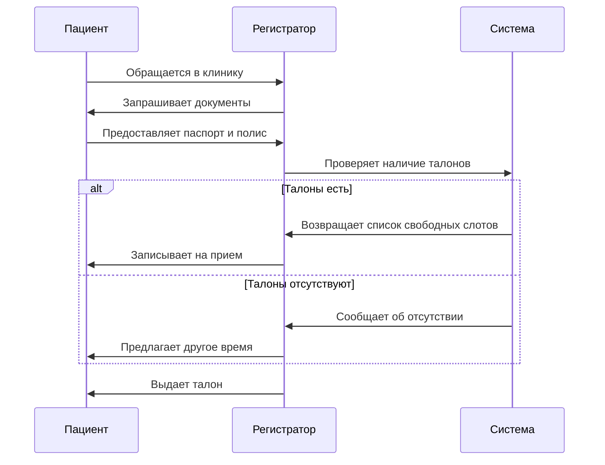

```mermaid
sequenceDiagram
    participant Пациент
    participant Регистратор
    participant Система

    Пациент->>Регистратор: Обращается в клинику
    Регистратор->>Пациент: Запрашивает документы
    Пациент->>Регистратор: Предоставляет паспорт и полис
    Регистратор->>Система: Проверяет наличие талонов
    
    alt Талоны есть
        Система->>Регистратор: Возвращает список свободных слотов
        Регистратор->>Пациент: Записывает на прием
    else Талоны отсутствуют
        Система->>Регистратор: Сообщает об отсутствии
        Регистратор->>Пациент: Предлагает другое время
    end
    
    Регистратор->>Пациент: Выдает талон
```
